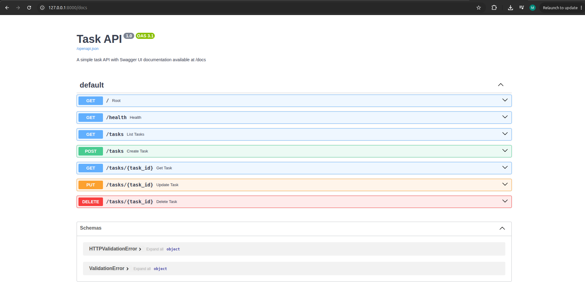

# Task API

A simple FastAPI task management service built in stages 0–5.

This repository contains a REST API with in-memory task storage, full CRUD operations, health checks, and Swagger UI documentation.

## Install & Run

From the repository root, run:

```bash
./env/bin/python stage5.py
```

Then open:

- `http://127.0.0.1:8000/docs` — Swagger UI
- `http://127.0.0.1:8000/openapi.json` — OpenAPI document

## Endpoints

| Method | Path          | Description                                      |
| ------ | ------------- | ------------------------------------------------ |
| GET    | `/`           | API metadata and available endpoints             |
| GET    | `/health`     | Health check with `status: ok`                   |
| GET    | `/tasks`      | List all tasks                                   |
| GET    | `/tasks/{id}` | Get a single task by id                          |
| POST   | `/tasks`      | Create a new task with JSON `{ "title": "..." }` |
| PUT    | `/tasks/{id}` | Update a task's `title` and/or `done` fields     |
| DELETE | `/tasks/{id}` | Delete a task and return `204 No Content`        |

## Example curl output

```bash
curl -i http://127.0.0.1:8000/
```

Example response:

```
HTTP/1.1 200 OK
content-length: 58
content-type: application/json

{"name":"Task API","version":"1.0","endpoints":["/tasks"]}
```

## Swagger UI



## Notes

- The code is organized across stage files: `stage0.py` through `stage5.py`.
- `stage5.py` is the main entrypoint for the documented API and Swagger UI.
- The repository includes a Python virtual environment in `env/` with FastAPI and Uvicorn installed.
